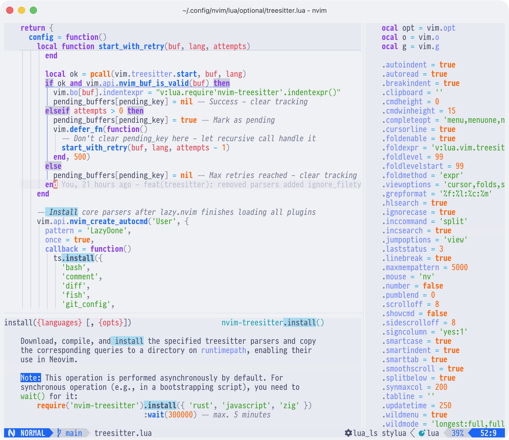
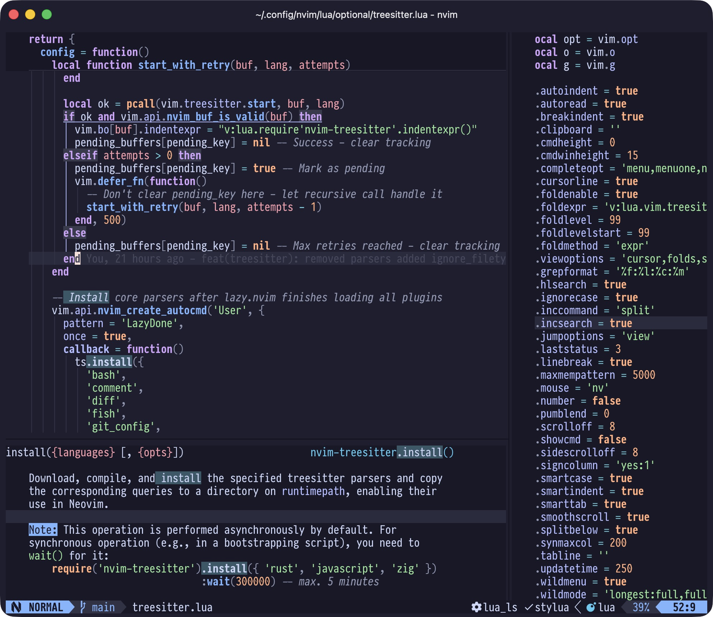
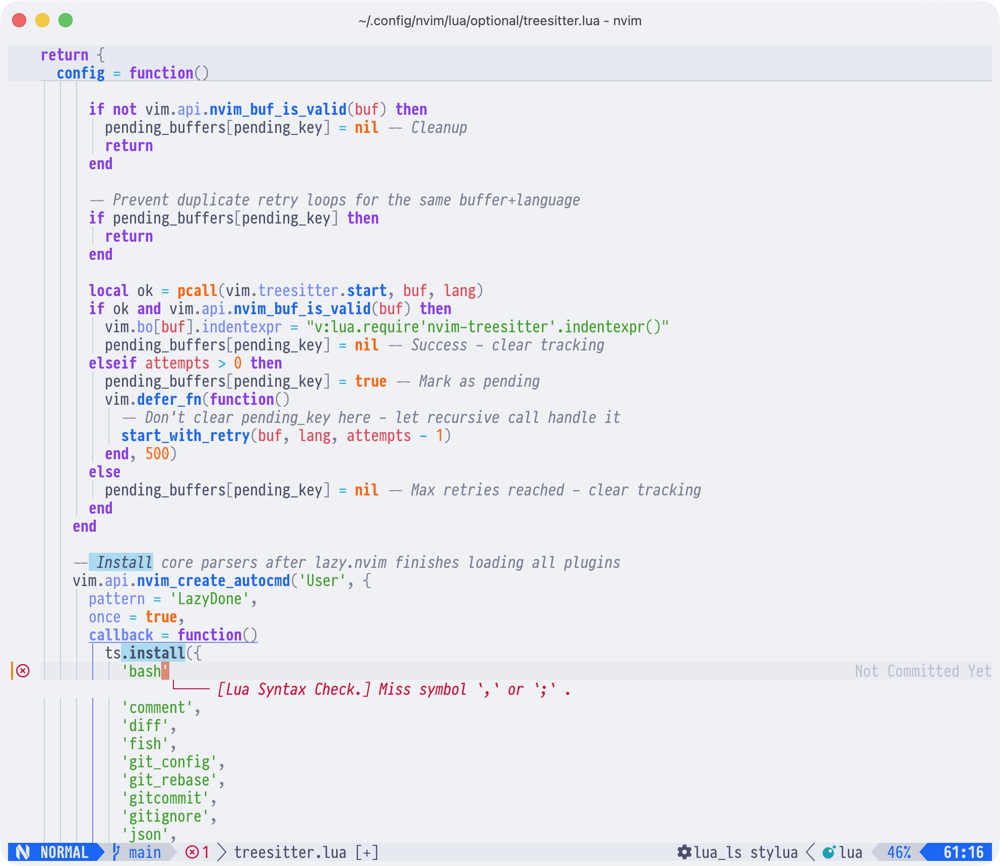
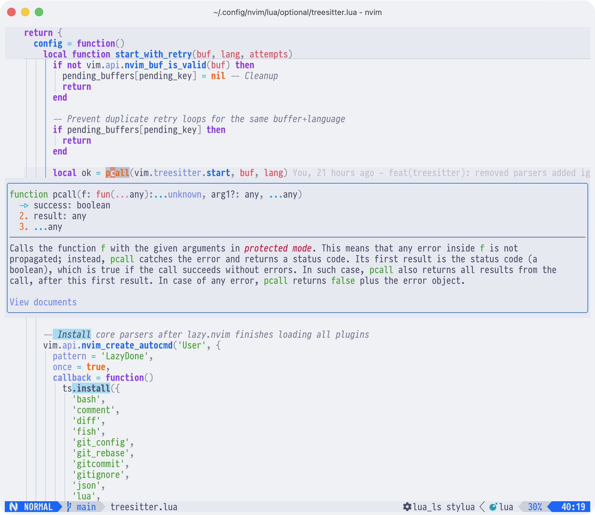

# My Neovim Configuration

Personal setup, maintained since December 2023. Two modes: lightweight by
default, full IDE when you need it.

## Showcase

 



Screenshots show virtual diagnostics, inline documentation, gitsigns, and
treesitter highlighting. Font is
[PragmataPro Variable](https://fsd.it/shop/fonts/pragmatapro-variable/), theme
is [Catppuccin](https://github.com/catppuccin/nvim), terminal is
[Ghostty](https://ghostty.org/).

## Two Modes

The default loads just the core config - fast startup for quick edits.

Set `NVIM_OPTIONAL_PLUGINS` to `1` to enable the full plugin suite (~30 plugins:
LSP, completion, git integration, fuzzy finder, debugger, and more).

The configuration is stability and performance oriented so despite enabling all
plugins is still loads quite quick.

```sh
~ % hyperfine "nvim +qa"
Benchmark 1: nvim +qa
  Time (mean ± σ):      28.8 ms ±   0.7 ms    [User: 15.8 ms, System: 7.2 ms]
  Range (min … max):    27.3 ms …  30.7 ms    93 runs
```

## Installation

### Dependencies (macOS)

```sh
brew install ripgrep fd cmake git node wget shellcheck python3 \
selene hg nvim lazygit imagemagick gs tree-sitter-cli
```

```sh
npm install -g neovim
```

### Clone

```sh
git clone --depth 1 https://github.com/ThorstenRhau/neovim.git ~/.config/nvim
```

### First launch

1. Open `nvim` - lazy.nvim installs plugins, treesitter installs parsers
2. Run `:MasonToolsInstall` to install LSPs, linters, and formatters
3. Restart and run `:checkhealth` to verify everything works

### Git hooks

If you plan to contribute, enable the pre-commit hook:

```sh
make install-hooks
```

## Keymaps

Leader is `Space`. Press `<leader>?` to see all available mappings.

| Prefix      | Purpose            |
| ----------- | ------------------ |
| `<leader>a` | Claude AI          |
| `<leader>c` | Code (LSP, format) |
| `<leader>d` | Debug              |
| `<leader>f` | Find files         |
| `<leader>g` | Git                |
| `<leader>o` | Oil file browser   |
| `<leader>q` | Session            |
| `<leader>s` | Search             |
| `<leader>t` | Terminal           |
| `<leader>u` | UI toggles         |
| `<leader>x` | Diagnostics        |

## Structure

```txt
init.lua
├── lua
│   ├── config     # options, keymaps, autocmds
│   ├── optional   # only loaded when NVIM_OPTIONAL_PLUGINS is set
│   ├── plugins    # always loaded
│   └── themes     # catppuccin
└── spell          # dictionaries for spelling
```

## Thank you

There are many individuals and projects that I have learned and taken
inspiration from. Thank you to all of you 🙏.
