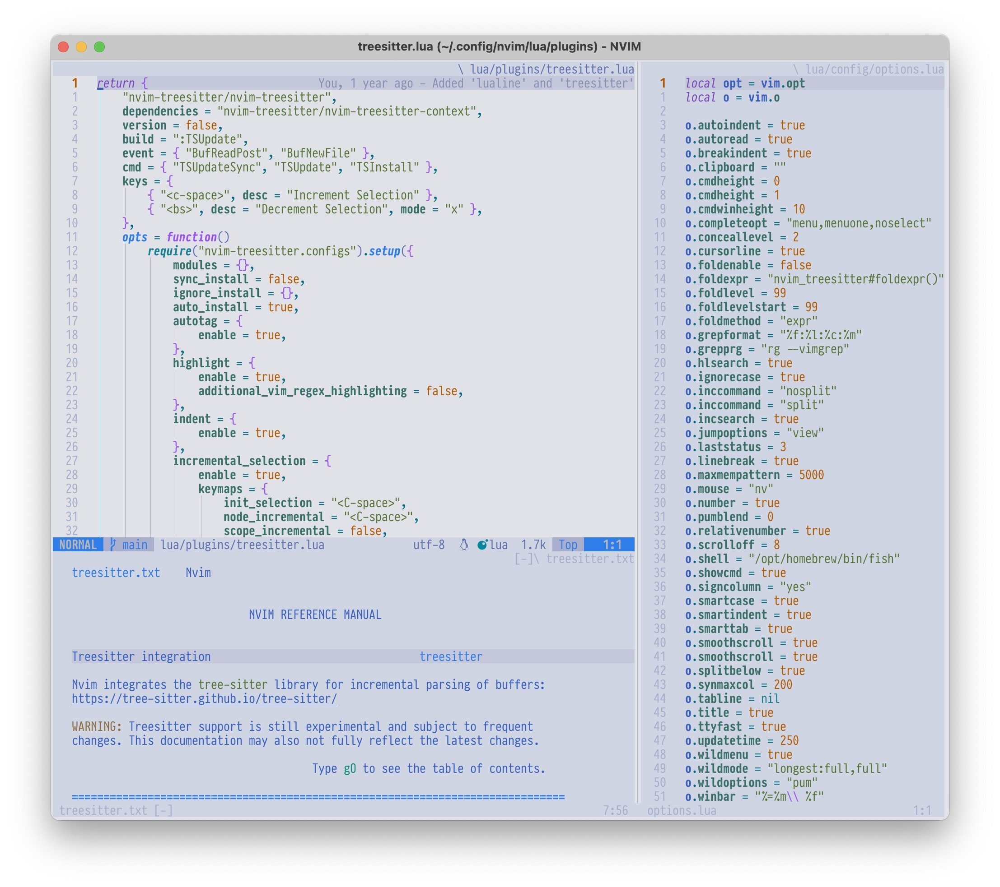
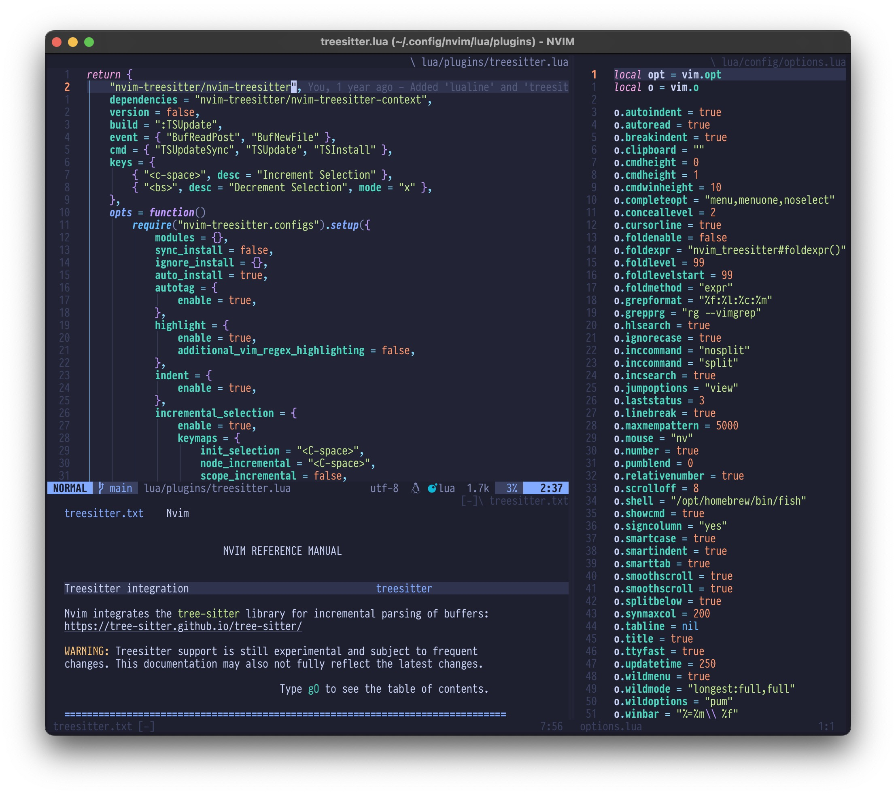

# My neovim configuration

This setup is "by me for me", intended for my personal use.

In case you want to use my setup for learning or something else I have written
some documentation that should help you to get started.

Since 2023-12-24 I consider this repo as stable. It should be safe to clone it
and stay on the main branch. There will be changes but all changes will be
documented and I hope that no breaking changes slip through the cracks.

2024 Christmas update: I have been using this configuration as my daily driver
for a year now. It has evolved quite a bit since the start.

Click image for video<br>
[](https://www.youtube.com/watch?v=xW6NysFLmvE)

If you want to make this configuration your own, just clone it and remove the
_.git_ directory from the root folder.

## Showcase

 

_The font used on the pictures is
[Pragmata Pro](https://fsd.it/shop/fonts/pragmatapro/) with ligatures and the
theme is [Tokyo Night](https://github.com/folke/tokyonight.nvim)_

## Installation

### Optional plugins

Before I maintained two configurations. One light weight and one fully featured.
They have now been merged into this configuration.

The default is lightweight, to enable LSP, linting, formatting, and all the
other plugins that are found in **lua/optional** you only need to set the
environment variable **NVIM_OPTIONAL_PLUGINS** to **1**

Example for fish shell

```fish
set -gx NVIM_OPTIONAL_PLUGINS 1
```

Example for zsh and bash

```sh
export NVIM_OPTIONAL_PLUGINS=1
```

### Dependencies

I use macOS so here are the instructions for how to install dependencies with
homebrew on a mac.

```sh
brew install ripgrep fd cmake git node wget shellcheck python3 \
selene hg nvim lazygit imagemagick gs
```

```sh
npm install -g neovim
npm install -g @mermaid-js/mermaid-cli
```

> **Tip:** Run `npm update -g` periodically to keep your global Node.js packages
> up to date.

### Cloning the repository

When you have all the dependencies installed, clone the repo into
_~/.config/nvim/_

Example:

```sh
git clone https://github.com/ThorstenRhau/neovim.git ~/.config/nvim
```

### First launch

When you launch neovim for the first time after cloning the repository you will
see a lot going on. Plugins should be installed by Lazy and Treesitter should
install language parsers. Thereafter you can run **_:MasonToolsInstall_** to
install all LSPs, Linters, and Formatters for this configuration. When this is
done it is a good idea to quit or re-start neovim.

### Verify your installation

Launch neovim and run _:Lazy load all_ to load all the plugins. After you have
loaded all the plugins you can run _:checkhealth_ to see that everything is
configured and working properly before you start to use neovim for your editing.

### Git Hooks

If you intend to make changes to this configuration and commit them to git,
please enable the git hooks. This ensures that `make all` (formatting, linting,
tests) runs before every commit.

```sh
make install-hooks
```

## Thank you

There are many individuals and projects that I have learned and taken
inspiration from. Thank you to all of you 🙏.
