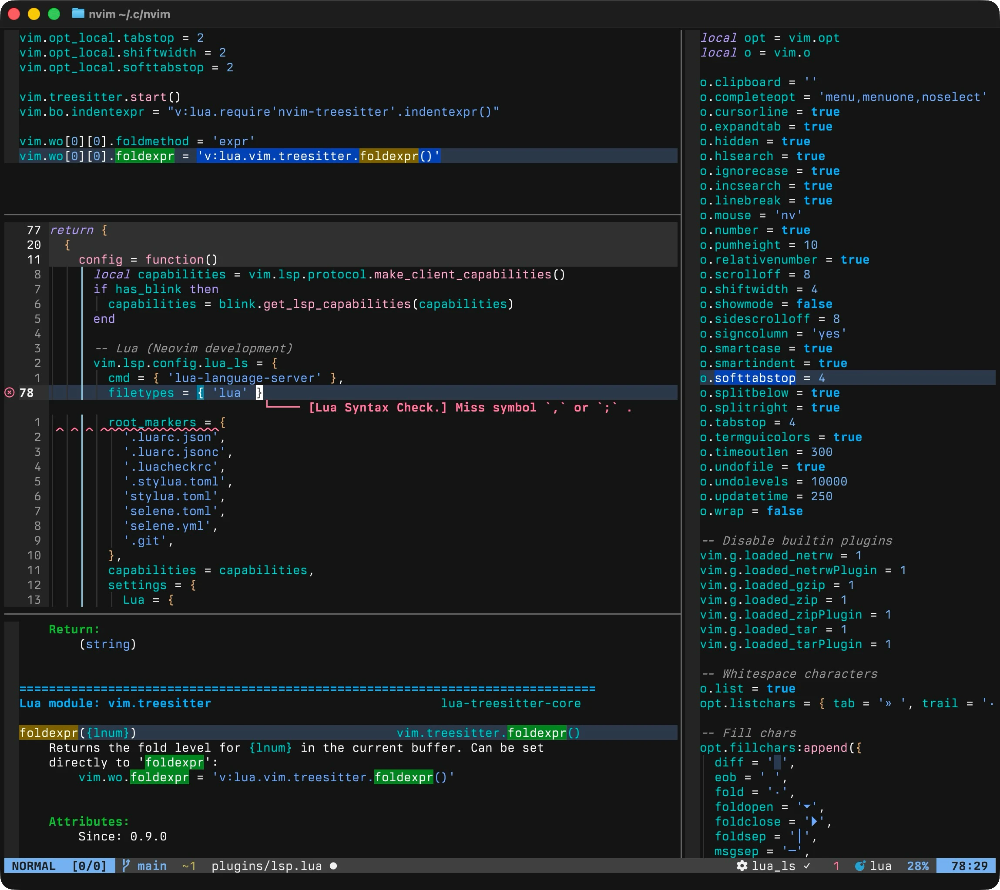
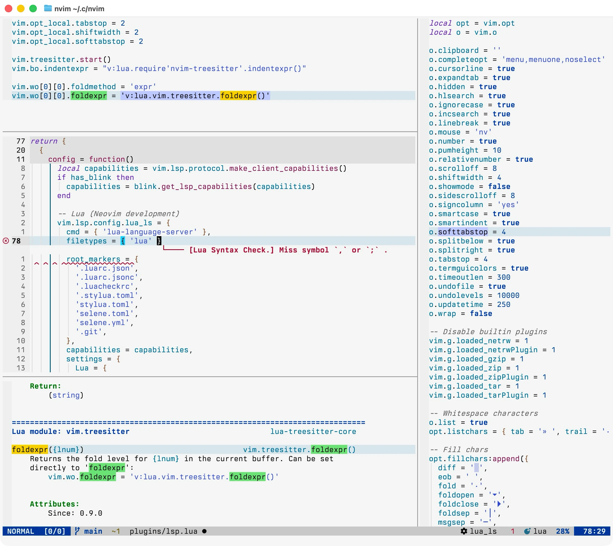

# My Neovim Configuration

[](https://neovim.io)
[](https://www.lua.org)
[](LICENSE)
[](https://github.com/ThorstenRhau/neovim/commits/main)
[](https://github.com/ThorstenRhau/neovim)
[](https://github.com/ThorstenRhau/neovim)

Personal configuration, maintained since December 2023. After 1000+ commits I
decided it was time for a complete rewrite in January 2026 — a clean slate built
on Neovim 0.11's native APIs.

The `main` branch is my daily driver. I use this config for my actual work, so
it's well-tested but occasionally in flux.

If anything here serves as a reference or inspiration for your own setup, I'm
glad it could help.

## Showcase

The theme is a modified version of
[Modus](https://github.com/miikanissi/modus-themes.nvim) paired with the
typeface [Berkeley Mono](https://usgraphics.com/products/berkeley-mono).




## Philosophy

This config is built around a few core principles:

- **Modern APIs first** — Uses Neovim 0.11's native `vim.lsp.config`,
  `vim.lsp.enable()`, `vim.diagnostic.jump()`, and built-in floating window
  borders. No compatibility shims for older versions.

- **Treesitter on main** — Runs the `main` branch of nvim-treesitter for the
  latest parser improvements and syntax highlighting.

- **Modular by design** — One concern per file. Core config lives in
  `lua/config/`, plugin specs live in `lua/plugins/`. Easy to navigate and
  maintain.

- **Performance** — Lazy-loading via events, commands, and keys. Disabled
  built-in plugins I don't use.

- **Keyboard-first, discoverable** — Space as leader with semantic groupings
  (`<leader>f` for files, `<leader>s` for search, `<leader>g` for git).
  which-key makes everything discoverable.

- **Readable UI** — Modus color scheme tweaks to avoid pure black or white
  backgrounds and added custom highlights for better plugin integration. Smooth
  scrolling. No visual clutter.

## Structure

```
~/.config/nvim/
├── init.lua                    # Entry point
├── lua/
│   ├── config/                 # Core configuration
│   │   ├── autocmds.lua        # Auto-commands
│   │   ├── keymaps.lua         # Global keymaps
│   │   ├── lazy.lua            # Plugin manager bootstrap
│   │   └── options.lua         # Vim options
│   └── plugins/                # Plugin specs (one file per category)
│       ├── colorscheme.lua     # Modus theme + custom highlights
│       ├── completion.lua      # blink.cmp
│       ├── editor.lua          # Editing aids
│       ├── explorer.lua        # oil.nvim
│       ├── format.lua          # conform.nvim + nvim-lint
│       ├── git.lua             # gitsigns, neogit, diffview
│       ├── lsp.lua             # LSP servers, Mason
│       ├── mini.lua            # mini.nvim modules
│       ├── picker.lua          # fzf-lua
│       ├── terminal.lua        # toggleterm + lazygit
│       ├── treesitter.lua      # Treesitter + textobjects
│       └── ui.lua              # which-key, lualine, trouble
└── after/ftplugin/             # Filetype-specific settings
```

## Requirements

- Neovim 0.11+
- ripgrep, fd, git, node (for LSP servers)

### macOS

```sh
brew install neovim ripgrep fd git node
```

## Installation

```sh
git clone --depth=1 https://github.com/ThorstenRhau/neovim.git ~/.config/nvim
```

## Acknowledgments

This config wouldn't exist without the incredible Neovim community — plugin
authors, core contributors, and everyone sharing their knowledge and ideas. The
ecosystem is what makes Neovim special.
