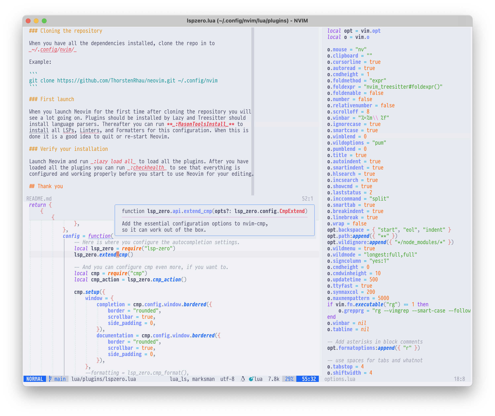

# My NeoVim configuration

This setup is "by me for me", intended for my personal use.

In case you want to use my setup for for learning or something else I have
written some documentation that should help you to get started.

Since 2023-12-24 I consider this repo as stable. It should be safe to clone it
and stay on the main branch. There will be changes but all changes will be
documented and I hope that no breaking changes slip through the cracks.

If you want to make this configuration your own, just clone it and remove the
_.git_ directory from the root folder.

## Showcase



## Installation

### Dependencies

I use macOS so here are the instructions for how to install dependencies with
homebrew on a mac.

```
brew install ripgrep fd cmake git node wget shellcheck python3 selene hg nvim
```

```
npm install -g neovim
```

### Cloning the repository

When you have all the dependencies installed, clone the repo in to
_~/.config/nvim/_

Example:

```
git clone https://github.com/ThorstenRhau/neovim.git ~/.config/nvim
```

### First launch

When you launch Neovim for the first time after cloning the repository you will
see a lot going on. Plugins should be installed by Lazy and Treesitter should
install language parsers. Thereafter you can run **_:MasonToolsInstall_** to
install all LSPs, Linters, and Formatters for this configuration. When this is
done it is a good idea to quit or re-start Neovim.

### Verify your installation

Launch Neovim and run _:Lazy load all_ to load all the plugins. After you have
loaded all the plugins you can run _:checkhealth_ to see that everything is
configured and working properly before you start to use Neovim for your editing.

## Thank you

There are many individuals and projects that I have learnt and taken inspiration
from. Thank you to all of the fantastic Neovim community 🙏.
